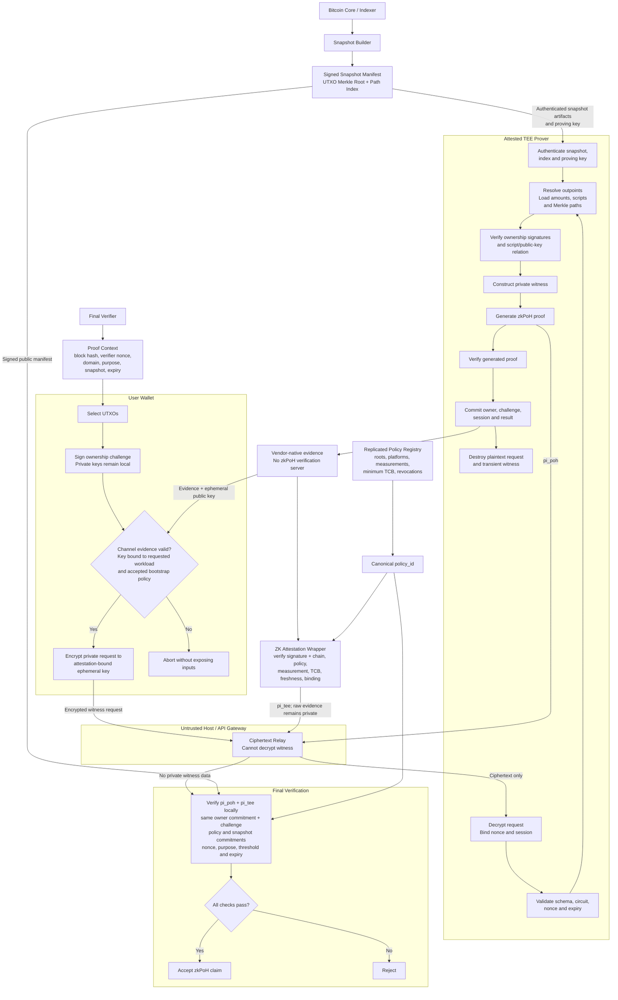

# zkPoH Verifiable Attested Remote Prover

**Technical Integration Specification**
**Version:** 0.2 - Draft for PoC Implementation
**Date:** 8 August 2026
**Project:** zkPoH - Zero-Knowledge Proof of Hodl

## 1. Purpose

This specification defines a **verifiable attested remote prover** for zkPoH. The service maintains Bitcoin chain data, deterministic UTXO snapshots, Merkle indexes, proving circuits, and proving keys, while private proof requests are processed inside a Trusted Execution Environment (TEE).

The protocol MUST NOT require a centralized TEE-verification server. A TEE produces vendor-native attestation evidence, and a zero-knowledge attestation wrapper converts it into a portable proof, `pi_tee`, that any relying party can verify against a public, versioned zkPoH attestation policy. The policy, circuit verification keys, approved workload measurements, vendor roots, minimum TCB values, and revocations are committed through a replicated governance mechanism.

The primary Version 0.2 privacy model requires the user to verify channel-establishment evidence and encrypt the private witness to an ephemeral key bound to the approved TEE workload. The surrounding host transports ciphertext and schedules work but is not intended to access plaintext outpoints, public keys, signatures, amounts, Merkle paths, blindings, or link secrets.

The service accepts a privately submitted proof request, generates a zero-knowledge holdings proof and a zero-knowledge TEE-attestation proof, and returns:

1. a portable zkPoH proof envelope;
2. the signed snapshot manifest used by the proof; and
3. `pi_tee`, proving that accepted hardware ran an approved workload under the selected policy and bound the execution to the same challenge and hidden owner commitment as the holdings proof; and
4. an optional signed operational receipt. A receipt provides service provenance only and is never a trust root for TEE validity.

The service is confidential with respect to both the final verifier and, subject to the TEE assumptions in this document, the host operator. The verifier does not learn the selected Bitcoin outputs, scripts, public keys, signatures, exact values, or Merkle paths.

A **conventional trusted remote prover** that can observe plaintext witnesses is defined only as a weaker development and fallback profile. It must not claim host-confidential witness processing or use the attested profile label.

### 1.1 Terminology

| Term | Meaning |
|---|---|
| Trusted Execution Environment (TEE) | Hardware-backed isolated execution environment intended to protect code and data from the host operating system and operator. |
| Remote attestation | Vendor-native signed evidence about a TEE platform, workload measurement, TCB state, and report data. It is private witness material for `pi_tee` unless client-side channel establishment requires direct inspection. |
| Zero-knowledge TEE attestation (`pi_tee`) | A portable proof that hidden native evidence satisfies a public zkPoH attestation policy and binds an approved execution to the public challenge and owner commitment. |
| Attestation policy registry | A replicated, authenticated registry of accepted platforms, vendor roots, measurements, minimum TCBs, revocations, wrapper circuits, and governance metadata. |
| Workload measurement | Cryptographic identity of the approved prover image, configuration, circuit registry, and security-relevant runtime. |
| Attested confidential prover | Remote prover whose private request is encrypted to and processed inside a client-verified TEE. |
| Conventional trusted prover | Weaker profile in which the server operator can access plaintext witness data. |
| Host | Infrastructure outside the TEE, including the operating system, orchestrator, API gateway, storage, and service operator. |
| Attestation policy | A canonical, content-addressed rule set defining accepted TEE families, measurements, security versions, debug state, freshness, and revocation status. |

## 2. Privacy Claim

The primary attested profile intends to provide:

| Party | Intended access to selected UTXOs? | Learns private keys? |
|---|---:|---:|
| Final verifier | No | No |
| Public observer | No | No |
| Snapshot publisher | Not from snapshot publication alone | No |
| Host and service operator | No plaintext access, subject to TEE assumptions | No |
| Attested prover workload | Yes, transiently inside the TEE | No |
| User wallet | Yes | Yes |

The TEE does not create an absolute privacy guarantee. The user still relies on the selected hardware roots and implementation, approved workload, key-binding mechanism, public security policy, and stated side-channel defenses. Neither the user nor final verifier trusts a service operator to interpret attestation correctly: `pi_tee` is verified locally against the exact public `policy_id`.

In the fallback conventional profile, the host and operator can observe the submitted witness. Any UI, API documentation, receipt, or marketing claim must identify which profile generated a proof.

## 3. Goals

1. Let users generate zkPoH proofs without downloading the full snapshot or running Noir locally.
2. Keep Bitcoin private keys on the user's signing device.
3. Hide selected UTXOs and exact holdings from the final verifier.
4. Bind every proof to a deterministic, signed Bitcoin UTXO snapshot.
5. Prove, without revealing device identity or raw attestation metadata, that accepted hardware ran approved software under a public policy.
6. Prevent replay and proof substitution through canonical contexts, nonces, and expiries.
7. Encrypt private requests end-to-end from the user wallet to an attested TEE workload.
8. Bind `pi_tee` and the holdings proof to the same fresh challenge, session, and hidden owner commitment.
9. Minimize retention of outpoints, public keys, signatures, paths, and witness files inside the TEE.
10. Support multiple TEE families and optional N-of-M independent-family attestation without changing the application-facing statement.
11. Make policy history, updates, and revocations independently discoverable and verifiable.

## 4. Non-goals for Version 0.2

- Eliminating all trust in manufacturer hardware roots, approved workloads, or hardware security boundaries.
- Complete protection against every timing, cache, memory-access, speculative-execution, traffic-analysis, or physical side channel.
- Sending Bitcoin private keys or seed phrases to the server.
- Proving that the server deleted submitted data.
- Eliminating trust in the snapshot publisher.
- Full Bitcoin consensus verification inside the ZK circuit.
- Anonymous service payment or network-level anonymity.
- Multi-party computation, private information retrieval, or fully homomorphic proving.
- Production deployment without an independent security and privacy review.

## 5. Trust Model

For the primary attested profile, the user relies on:

- the TEE hardware and firmware to enforce its documented isolation boundary;
- manufacturer roots to authenticate genuine platform evidence;
- the selected public policy and its governance to admit only acceptable platforms, measurements, TCB versions, and revocation state;
- the zero-knowledge attestation circuit and verification key to enforce that policy correctly;
- the measured workload to validate requests, use the requested circuit and snapshot, and avoid exporting private witnesses;
- the workload-bound encryption key to terminate private-request encryption inside the TEE;
- the implementation's documented side-channel and rollback mitigations.

The user does not need to trust the host operator with plaintext witness confidentiality when all attestation and encryption requirements succeed. The host remains capable of denial of service, traffic observation, scheduling manipulation, and returning stale or malformed data.

The user does **not** trust the prover with Bitcoin private keys. Ownership authorization is produced locally using a challenge signature.

The verifier does not trust the prover or a centralized attestation verifier. It independently verifies both `pi_poh` and `pi_tee`, their shared public bindings, the applicable policy commitment, and the policy registry authentication. A prover signature or receipt may supply provenance but does not establish attestation validity.

The verifier separately decides whether to trust or reproduce the signed snapshot root. A verifier requiring the attested profile validates `pi_tee` against an accepted `policy_id` and checks that `pi_tee` and `pi_poh` bind the same challenge and owner commitment.

## 6. High-Level Architecture

```text
 Bitcoin snapshot             Public attestation policy registry
        |                          |
        v                          v
 User wallet --encrypted request--> TEE / secure hardware
                                        | approved code verifies ownership,
                                        | binds challenge + owner commitment,
                                        | and generates pi_poh
                                        v
                              native attestation evidence
                                        |
                                        v
                              ZK attestation wrapper
                                        |
                                  pi_tee + pi_poh
                                        |
                                        v
                          any relying party verifies locally
```



Recommended service boundaries:

```text
API gateway
  -> native evidence and policy discovery
  -> ciphertext relay
  -> attested proving worker
  -> zero-knowledge attestation wrapper
  -> proof verifier
  -> optional receipt signer

snapshot builder
  -> canonical snapshot artifacts
  -> Merkle path index
  -> manifest signer
```

Private-request decryption, ownership pre-checks, witness resolution, and proving must occur inside the measured TEE boundary. Native evidence may be wrapped inside or outside the TEE, but the wrapper must prove its validity and binding without trusting the wrapper operator. Raw evidence, certificate chains, device identifiers, and platform-specific metadata must not be public outputs. Optional receipt and snapshot signers use separate keys.

## 7. End-to-End Protocol

### 7.1 Snapshot publication

1. The snapshot builder selects an exact Bitcoin block hash and height.
2. It deterministically regenerates the complete UTXO snapshot.
3. It computes the versioned Merkle root and supporting path index.
4. It creates and signs a canonical snapshot manifest.
5. The service publishes the manifest before accepting proof requests against it.

### 7.2 Challenge creation

The user or verifier constructs a proof context containing:

- protocol and circuit version;
- application domain and verifier identity;
- proof purpose;
- accepted snapshot manifest hash;
- a recent Bitcoin block hash used as a freshness anchor;
- threshold or other public predicate;
- unpredictable nonce;
- issuance time and expiry.

The challenge is derived from the Bitcoin block hash, verifier nonce, application domain, and complete proof context. The block supplies public temporal context and the nonce supplies unpredictability; neither is sufficient alone. The wallet must independently display and validate the context. It must not blindly sign an opaque digest supplied by the server.

### 7.3 Attestation and secure channel

Before submitting private inputs, the wallet:

1. obtains fresh attestation evidence and the workload's ephemeral encryption key;
2. verifies enough native evidence locally to establish the confidential channel before disclosure, including freshness and the ephemeral-key binding;
3. verifies that the measurement is approved for the requested circuit ID and protocol version;
4. binds the server endpoint, request nonce, and ephemeral key to the attested session; and
5. aborts without transmitting private inputs if any attestation-policy check fails.

Ordinary TLS may additionally protect transport metadata, but TLS termination outside the TEE does not satisfy private-witness confidentiality. The private request body must be application-layer encrypted to a key whose possession is bound by attestation to the approved workload.

### 7.4 Local ownership authorization

For every selected P2WPKH UTXO, the wallet signs the canonical challenge digest using the controlling Bitcoin key.

The private key never leaves the wallet. The remote prover receives only the outpoint, compressed public key, and signature.

### 7.5 Attested remote proof generation

Inside the attested workload, the service:

1. decrypts the private request and binds it to the attested session and client nonce;
2. validates the request schema, nonce, expiry, and supported circuit;
3. resolves each outpoint in an authenticated snapshot index available inside the TEE boundary;
4. retrieves the exact amount, scriptPubKey, creation metadata, and Merkle path;
5. checks the submitted signature and script/public-key relationship off-circuit as an early rejection step;
6. constructs the private circuit witness;
7. generates the ZK proof;
8. independently verifies the generated proof;
9. derives `owner_commitment = H(DOMAIN_OWNER_V1, owner_identity, owner_salt)` and binds it, the challenge, session, `pi_poh` hash, and ephemeral channel key into TEE report data;
10. obtains vendor-native attestation evidence over that report data;
11. generates `pi_tee` using the evidence, certificate path, and platform metadata as private witness;
12. returns only `pi_poh`, `pi_tee`, their shared public bindings, the public manifest and policy reference, plus any optional receipt; and
13. destroys transient private request, witness, and raw-attestation material according to the retention policy.

The host must not terminate application-layer witness encryption, resolve plaintext outpoints, pre-check ownership witnesses, receive plaintext prover diagnostics, or act as an authoritative attestation verifier.

### 7.6 Final verification

The final verifier:

1. validates the proof envelope and rejects unknown mandatory fields;
2. verifies the circuit ID and ZK proof;
3. verifies all expected public inputs;
4. verifies the snapshot manifest signature and snapshot policy;
5. resolves and authenticates the exact policy identified by `policy_id`;
6. independently verifies `pi_tee` using the policy-approved wrapper verification key;
7. checks that `pi_tee` enforces an accepted platform, approved measurement, debug-disabled state, sufficient TCB, non-revocation, freshness, and correct execution-result binding;
8. checks that `pi_tee` and `pi_poh` expose identical `owner_commitment`, `challenge_digest`, and session/result binding values;
9. checks the verifier nonce, Bitcoin freshness anchor, purpose, threshold, snapshot, and expiry;
10. optionally verifies a service receipt for provenance only; and
11. optionally checks nullifier uniqueness.

## 8. Canonical Challenge

```text
challenge_digest = H(
    DOMAIN_CHALLENGE_V1,
    protocol_version,
    circuit_id,
    application_domain,
    verifier_id,
    purpose,
    network,
    snapshot_manifest_hash,
    snapshot_root,
    snapshot_block_hash,
    threshold_sat,
    verifier_nonce,
    issued_at,
    expiry
)
```

Requirements:

- Canonical byte serialization must be shared by wallets, servers, circuits, and verifiers.
- The verifier nonce must have at least 128 bits of unpredictability.
- Threshold, snapshot, purpose, verifier, and expiry must be signed.
- The server must reject expired or excessively long-lived contexts.
- A wallet must show a human-readable disclosure summary before signing.

## 9. Proof Request

Example request:

```json
{
  "protocol": "zkpoh",
  "version": "0.2",
  "proof_type": "controlled_holdings",
  "circuit_id": "sha256:...",
  "snapshot_manifest_hash": "sha256:...",
  "context": {
    "application_domain": "example.com",
    "verifier_id": "verifier-key-or-id",
    "purpose": "minimum-balance-tier",
    "network": "regtest",
    "threshold_sat": 100000000,
    "verifier_nonce": "hex-encoded-random-nonce",
    "issued_at": "2026-08-04T12:00:00Z",
    "expires_at": "2026-08-04T12:10:00Z"
  },
  "inputs": [
    {
      "txid": "...",
      "vout": 0,
      "compressed_public_key": "...",
      "challenge_signature": "..."
    }
  ],
  "client_request_nonce": "hex-encoded-random-nonce"
}
```

The JSON above represents the plaintext application object inside the wallet and TEE. Over the host-facing API it must be carried in an encrypted request envelope containing only non-sensitive routing data, attestation-session identifiers, ciphertext, and integrity-protected associated data. The plaintext request must never be returned in the proof envelope or receipt.

The initial API may limit input count and support only P2WPKH. Unsupported scripts must fail closed.

## 10. Circuit Statement

The protocol composes two independently verifiable proofs.

`pi_poh`, the controlled-holdings proof, proves for each enabled UTXO:

```text
snapshot_leaf(hidden_record) is a member of public_snapshot_root
AND HASH160(hidden_compressed_public_key) matches hidden_script_pubkey
AND hidden_signature verifies over public_challenge_digest
AND hidden_record and control witness bind to the same hidden subject
AND context_tag is derived from the subject-bound link key and public context
```

Across all enabled UTXOs it proves:

```text
all enabled outpoints are distinct
AND checked_sum(hidden_amount_sat[i]) >= public_threshold_sat
```

It also exposes an owner commitment derived from the same hidden ownership identity used by the ownership checks.

`pi_tee`, the zero-knowledge attestation proof, proves:

```text
native attestation signature and certificate path are valid
AND platform family is accepted by policy_id
AND workload measurement is approved by policy_id
AND TCB satisfies the policy minimum and is not revoked
AND production/debug state satisfies policy
AND native report data binds challenge_digest, session_id,
    owner_commitment, pi_poh_hash, and ephemeral_channel_key_hash
AND the challenge is within the policy freshness window
```

The native attestation, certificate chain, device identifiers, exact platform subtype, and platform metadata are private inputs. Public outputs are limited to the common application statement defined by the wrapper circuit. Applications must not branch on vendor-specific proof formats.

Composition is valid only when both proofs have identical public `owner_commitment`, `challenge_digest`, and `execution_binding = H(pi_poh_hash, session_id)`. Recursive aggregation into one proof is permitted but not required.

The circuit must enforce Boolean selectors, canonical padding, amount ranges, bounded accumulation, and duplicate rejection.

## 11. Public and Private Inputs

### 11.1 Public inputs

- protocol version;
- circuit ID or version-bound circuit selector;
- network;
- snapshot root;
- snapshot block hash or epoch commitment;
- snapshot schema version;
- challenge digest or complete normalized context hash;
- public threshold;
- context-specific tag;
- optional nullifier;
- owner commitment;
- execution binding;
- attestation policy ID and policy epoch;
- fixed capacity or disclosed selected count, according to circuit policy.

### 11.2 Private inputs

- full txids and output indices;
- amounts;
- raw scriptPubKeys;
- creation heights and coinbase flags;
- compressed public keys;
- ownership signatures;
- Merkle paths and indices;
- enable flags;
- subject blindings;
- link secrets or request-scoped derived witnesses.

The private inputs to `pi_tee` additionally include native evidence, certificate or endorsement chains, platform claims, workload measurement openings, TCB values, and any membership paths required by the policy commitment.

No private input may appear in logs, receipts, metadata, filenames, job identifiers, or error messages.

## 12. Subject-Bound Linking

Tags must bind both the hidden subject and the link secret:

```text
subject_commitment = H(
    DOMAIN_SUBJECT_V1,
    hidden_utxo_record,
    subject_blinding
)

link_key = H(
    DOMAIN_LINK_KEY_V1,
    link_secret,
    subject_commitment
)

context_tag = PRF(
    link_key,
    DOMAIN_TAG_V1 || context_hash
)
```

Deriving a tag only from `link_secret` and context is forbidden because the same secret could otherwise link proofs concerning different UTXOs.

For Version 0.2, prefer fresh request-scoped link secrets unless an explicit bridge relationship is requested. A persistent link secret should not be entrusted to the remote prover without a documented custody model.

### 12.1 Cross-proof owner binding

`owner_commitment` must commit to the ownership identity actually checked by `pi_poh`, not merely to an unconstrained user-supplied value. For multi-UTXO proofs the circuit must define a canonical aggregate owner identity or prove the policy-approved relationship among all controlling keys. Both proofs expose only the commitment; neither exposes Bitcoin keys or addresses.

### 12.2 Attestation policy registry

Each canonical policy document must include:

- `policy_id = H(canonical_policy_document)` and monotonically ordered policy epoch;
- accepted TEE families and vendor/endorsement roots;
- approved reproducible workload measurements and source/build metadata;
- minimum TCB or security-version rules per family;
- disallowed debug or lifecycle states;
- revoked platforms, versions, keys, measurements, and evidence ranges;
- freshness rules and accepted Bitcoin anchor age;
- approved ZK wrapper circuit IDs and verification keys;
- optional N-of-M rules requiring distinct TEE families; and
- governance keys, signature threshold, activation time, and predecessor policy ID.

The registry must be replicated and independently retrievable. Acceptable anchoring profiles include a Bitcoin commitment, a smart-contract registry, or threshold-signed append-only events. A single operator-controlled database or mutable HTTPS response is not sufficient. Clients and verifiers must pin a governance rule and reject unknown, rollback, conflicting, or prematurely activated policies.

Policy updates do not rewrite history. A proof is evaluated against its committed policy epoch plus the verifier's explicit rule for later revocations. Emergency revocation semantics, including whether already-issued unexpired proofs remain acceptable, must be declared by the relying-party policy.

## 13. Snapshot Manifest

The snapshot manifest follows the deterministic-regeneration model and binds:

```json
{
  "format": "zkpoh-utxo-snapshot",
  "version": "1",
  "network": "regtest",
  "block_height": 250,
  "block_hash": "...",
  "leaf_schema": "zkpoh-utxo-leaf-v1",
  "tree_schema": "zkpoh-binary-merkle-v1",
  "hash_function": "blake2s-256",
  "tree_depth": 16,
  "entry_count": 42,
  "root": "...",
  "created_at": "2026-08-04T12:00:00Z",
  "publisher_key_id": "...",
  "signature": "..."
}
```

The signature covers a canonical encoding of every field except `signature`.

Timestamps and generator metadata must not affect the Merkle root. The block hash, schemas, entry count, tree parameters, and root must be included in the signed manifest.

## 14. Proof Envelope

```json
{
  "protocol": "zkpoh",
  "version": "0.2",
  "proof_type": "controlled_holdings",
  "network": "regtest",
  "circuit_id": "sha256:...",
  "snapshot_manifest_hash": "sha256:...",
  "public_inputs": {
    "snapshot_root": "...",
    "context_hash": "...",
    "threshold_sat": 100000000,
    "context_tag": "...",
    "owner_commitment": "...",
    "execution_binding": "...",
    "policy_id": "sha256:...",
    "policy_epoch": 1
  },
  "pi_poh": "base64-or-hex",
  "pi_tee": "base64-or-hex",
  "created_at": "2026-08-04T12:01:00Z",
  "expires_at": "2026-08-04T12:10:00Z",
  "metadata": {}
}
```

The envelope must not contain outpoints, addresses, public keys, scripts, exact values, ownership signatures, Merkle paths, blindings, link secrets, raw TEE evidence, certificate chains, device identifiers, or vendor-specific metadata.

## 15. Optional Signed Generation Receipt

The receipt optionally authenticates the service and binds the complete returned result. Verifiers must not require it as evidence that TEE policy was satisfied:

```text
pi_poh_hash = SHA256(canonical_pi_poh_bytes)
pi_tee_hash = SHA256(canonical_pi_tee_bytes)

public_inputs_hash = SHA256(
    canonical_public_inputs
)

receipt_hash = H(
    DOMAIN_PROOF_RECEIPT_V1,
    protocol_version,
    pi_poh_hash,
    pi_tee_hash,
    public_inputs_hash,
    circuit_id,
    snapshot_manifest_hash,
    client_request_nonce,
    created_at,
    expires_at,
    generator_key_id,
    execution_profile,
    policy_id,
    owner_commitment,
    execution_binding
)
```

Public `tee_platform`, `workload_measurement`, and `attestation_evidence_hash` fields are forbidden in the standard attested profile because they can undo the wrapper's privacy guarantees. A diagnostic profile may expose them only with explicit disclosure and must use a distinct profile identifier.

Example:

```json
{
  "format": "zkpoh-proof-receipt",
  "version": "1",
  "pi_poh_hash": "sha256:...",
  "public_inputs_hash": "sha256:...",
  "circuit_id": "sha256:...",
  "snapshot_manifest_hash": "sha256:...",
  "client_request_nonce": "...",
  "created_at": "2026-08-04T12:01:00Z",
  "expires_at": "2026-08-04T12:10:00Z",
  "generator_key_id": "...",
  "execution_profile": "attested-confidential",
  "policy_id": "sha256:...",
  "pi_tee_hash": "sha256:...",
  "owner_commitment": "...",
  "execution_binding": "...",
  "signature": "..."
}
```

The receipt must not hash or expose a request body containing private inputs. It binds the public result and the client's unlinkable request nonce.

The receipt proves neither snapshot correctness, ZK statement validity, nor TEE acceptability. Those require manifest validation, verification of `pi_poh` and `pi_tee`, cross-proof binding checks, and policy-registry validation.

## 16. API Surface

Initial endpoints:

```text
GET  /v1/health
GET  /v1/circuits
GET  /v1/circuits/{circuit_id}
GET  /v1/snapshots/latest?network=regtest
GET  /v1/snapshots/{manifest_hash}
POST /v1/challenges/validate
POST /v1/proofs/controlled-holdings
GET  /v1/jobs/{opaque_job_id}
DELETE /v1/jobs/{opaque_job_id}
```

Requirements:

- API versioning is mandatory.
- Requests must have strict size and UTXO-count limits.
- Job IDs must be random and unrelated to outpoints or public keys.
- Polling responses must not echo private request inputs.
- Authorization tokens must not be placed in URLs.
- Error responses must use generic public messages and private correlation IDs.
- Successful job retrieval should be optionally one-time.
- Idempotency must use a random client token, not a hash of private inputs.

## 17. Server Data Handling

### 17.1 Prohibited retention

The following must not be retained after the proof job completes or fails:

- outpoints submitted by the user;
- public keys and ownership signatures;
- resolved scripts, amounts, and Merkle paths associated with the request;
- subject blindings and link secrets;
- generated witness files;
- raw request bodies;
- prover stdout or error dumps containing witness values.

### 17.2 Logging

Allowed operational logs should be limited to:

- random job ID;
- circuit ID;
- coarse request and completion timestamps;
- success or generic failure category;
- proving duration and resource metrics;
- snapshot manifest hash;
- response size.

Reverse proxies, application frameworks, traces, analytics, crash reporters, and infrastructure logs must have body capture disabled.

### 17.3 Transient storage

If an in-memory proving API is unavailable:

- use an isolated per-job temporary directory;
- create files with owner-only permissions;
- never include outpoints in filenames;
- mount temporary storage without backup or replication;
- remove files after proof verification;
- document that deletion on conventional storage is an operational measure, not a cryptographic guarantee.

## 18. Key Management

Use separate keys for:

1. snapshot manifest signing;
2. proof receipt signing;
3. TLS termination;
4. optional enclave attestation or deployment signing.

Signing keys should be held in an HSM or isolated signing service. Key IDs and validity intervals must be published. Rotation must preserve verification of historical, unexpired artifacts.

Compromise of a receipt-signing key must not permit spending Bitcoin or forging a valid ZK proof. Compromise of a snapshot-signing key can cause verifiers trusting only that publisher to accept a fabricated snapshot root.

## 19. Threats and Mitigations

### 19.1 Private-key theft

Attack: the service asks for a WIF, seed phrase, or raw private key.
Mitigation: the protocol accepts only locally generated signatures. Wallets reject any request to export key material.

### 19.2 Query correlation

Attack: the server links outpoints to accounts, IP addresses, or repeated requests.
Mitigation: minimal authentication, anonymous transport where appropriate, no request retention, standardized contexts, fresh request nonces, and attested confidential execution.

### 19.3 Malicious challenge

Attack: a server obtains a signature for a different verifier, purpose, threshold, or long-lived context.
Mitigation: wallet constructs or recomputes the canonical challenge and displays all material fields before signing.

### 19.4 Proof substitution

Attack: the server returns a valid proof for different public inputs.
Mitigation: wallet and verifier compare normalized public inputs to the request; receipt binds proof and public-input hashes.

### 19.5 Fabricated snapshot

Attack: the server builds a curated tree containing nonexistent or spent outputs.
Mitigation: deterministic regeneration, signed manifests, local reproduction or independent publisher quorum, and exact block-hash pinning.

### 19.6 Snapshot equivocation

Attack: the publisher signs different roots for the same block and schema.
Mitigation: public append-only manifest publication, independent monitors, publisher quorum, and local regeneration.

### 19.7 Ownership-witness replay

Attack: a captured signature is used for another proof.
Mitigation: challenge binds circuit, verifier, purpose, snapshot, threshold, random nonce, and short expiry.

### 19.8 Persistent link-secret abuse

Attack: the server uses a retained link secret to create unauthorized relationships.
Mitigation: request-scoped secrets, local derivation, explicit bridge authorization, and no server retention.

### 19.9 Side-channel leakage

Attack: proving time, memory, response size, or errors reveal UTXO count or script types.
Mitigation: fixed circuit capacity, canonical padding, uniform response envelopes, coarse errors, and optional job completion batching.

### 19.10 Denial of service

Attack: clients submit expensive invalid proving jobs.
Mitigation: cheap schema and signature pre-checks, rate limits, quotas, bounded input counts, authenticated capacity tiers, and isolated worker resource limits.

### 19.11 Centralized attestation-verifier substitution

Attack: a service claims that opaque native evidence passed policy or silently applies a weaker policy.
Mitigation: every relying party verifies `pi_tee`, `policy_id`, registry authentication, and cross-proof bindings locally. API verdicts are non-authoritative.

### 19.12 TEE compromise and policy rollback

Attack: vulnerable firmware, revoked endorsements, or an old policy remains usable.
Mitigation: policy epochs commit minimum TCB values and revocations; clients reject rollback and enforce activation/freshness rules; emergency policy updates are append-only and publicly monitorable.

## 20. Verifier Policy

A verifier policy should specify:

- accepted protocol versions and circuit IDs;
- accepted networks and snapshot schemas;
- accepted snapshot publishers or locally reproduced roots;
- accepted attestation-registry governance and policy IDs;
- approved attestation wrapper circuit IDs and verification keys;
- minimum TCB, revocation, and proof-time policy semantics;
- optional accepted remote-prover receipt keys for provenance only;
- maximum snapshot age and proof age;
- required verifier nonce and expiry bounds;
- minimum threshold;
- permitted script types;
- nullifier requirements;
- whether proofs generated by conventional or attested workers are accepted;
- whether one TEE or N-of-M distinct TEE families are required.

Verification fails closed on unknown circuit IDs, malformed contexts, unsupported scripts, expired proofs, inconsistent manifest hashes, invalid signatures, or public-input mismatch.

## 21. TEE and Zero-Knowledge Attestation Requirements

The primary execution profile requires a TEE, native remote attestation, and a zero-knowledge attestation wrapper. The public policy must name supported evidence formats, trust roots, minimum security versions, revocation sources, accepted workload measurements, and wrapper verification keys. Multiple platform adapters may map native claims into one common wrapper statement.

The attested flow is:

1. the client verifies native evidence as needed to safely establish the encrypted channel;
2. it encrypts the private request to a key bound to the attested prover image;
3. the host forwards ciphertext into the enclave;
4. the enclave resolves witnesses, generates `pi_poh`, and emits bound native evidence;
5. the wrapper proves in zero knowledge that the evidence satisfies `policy_id`;
6. any verifier checks `pi_tee` locally and composes it with `pi_poh` through their shared bindings.

The workload measurement must cover or authenticate:

- request validation and decryption code;
- circuit registry and allowed circuit IDs;
- witness construction and proof generation code;
- proof verification and receipt construction code;
- snapshot-manifest verification rules;
- key-release policy;
- debug-disabled production configuration;
- security-relevant runtime and dependencies.

Attestation evidence must be fresh and bind the ephemeral request-encryption key, challenge, owner commitment, session, and generated holdings proof. A reusable server TLS certificate, unsigned enclave public key, stale report, or assertion from an attestation-verification API is insufficient.

The wrapper circuit must verify native evidence signatures or endorsements, certificate/path rules, measurement approval, TCB thresholds, debug/lifecycle state, revocation membership or non-membership, freshness, and report-data binding. Where non-revocation cannot be proven efficiently, the policy may commit to an allowlist of acceptable TCB/platform states. All lists and roots used by the circuit must be committed by `policy_id`.

Manufacturer roots remain trust anchors for their hardware families; zero knowledge does not remove that dependency. Decentralization comes from open verification, vendor diversity, and governed public acceptance policy. No single manufacturer is mandatory unless a relying-party policy explicitly makes it so.

An optional multi-TEE profile proves that at least N distinct accepted TEE families attested to the same `owner_commitment`, challenge, and execution result. Family distinctness must be constrained inside the proof. The baseline profile remains one accepted TEE for usability.

Snapshot artifacts and proving keys stored outside the TEE must be authenticated before use. Private inputs, decrypted witnesses, and sensitive diagnostics must never be exported from the TEE. Sealed persistent storage is forbidden for user witnesses in Version 0.2.

Snapshot-index access can itself reveal an outpoint through host-observed file offsets, pages, cache activity, or object requests. A deployment must either keep the relevant lookup structure inside protected memory, use an access-pattern-hiding construction, fetch a sufficiently broad fixed dataset independent of the query, or disclose this leakage explicitly. Encryption of record contents alone does not hide access patterns.

This model removes the server operator and any centralized TEE-verification service from the attestation decision. It still relies on manufacturer roots, the policy governance, approved binaries and wrapper circuits, key-release policy, and side-channel defenses. The specification does not claim protection against every platform vulnerability, compromised firmware, physical attack, or traffic-analysis channel.

### 21.1 Conventional fallback profile

A development deployment may use `execution_profile = "conventional-trusted"`. In that profile, the operator can access plaintext witness data, `pi_tee` and its public bindings are absent, and the required user disclosure must explicitly say so. A verifier policy requiring `attested-confidential` must reject the proof envelope regardless of any receipt.

## 22. Testing Requirements

### 22.1 Functional tests

- valid controlled-holdings request succeeds;
- insufficient balance fails;
- nonexistent or spent outpoint fails;
- wrong key or signature fails;
- wrong Merkle path fails;
- duplicated outpoint fails;
- mismatched snapshot or circuit fails;
- expired and replayed challenges fail;
- returned proof verifies independently.

### 22.2 Signature tests

- manifest canonicalization vectors;
- receipt canonicalization vectors;
- proof and public-input mutation invalidate the receipt;
- manifest mutation invalidates its signature;
- key rotation and expiration policies behave as specified.

### 22.3 Attestation tests

- approved production measurement succeeds;
- unknown measurement and debug-enabled workload fail;
- stale, revoked, malformed, or wrong-platform evidence fails;
- evidence bound to a different ephemeral key fails;
- ciphertext replayed into a different session fails;
- fallback-profile proof envelope fails an attested-only verifier policy;
- invalid vendor signatures and certificate paths fail inside the wrapper;
- `pi_tee` reveals none of the prohibited native evidence fields;
- policy rollback, equivocation, invalid governance signatures, and revoked TCB states fail;
- changing `owner_commitment`, challenge, session, channel key, or `pi_poh` invalidates composition;
- two independent verifier implementations accept the same vectors without contacting an attestation-verification service;
- multi-TEE mode rejects duplicate or non-distinct families;
- optional receipt mutation does not affect proof validity but invalidates receipt provenance.

### 22.4 Privacy tests

- response contains no outpoint, address, script, public key, signature, amount, or path;
- access and application logs contain no private request fields;
- job IDs have no deterministic relationship to inputs;
- error messages do not reveal whether a particular outpoint exists;
- temporary witness files are absent after success and failure;
- context tags differ across unrelated contexts;
- the host-facing request contains ciphertext rather than witness fields;
- host logs and diagnostics cannot access decrypted requests;
- plaintext ownership pre-check and proving occur only inside the measured workload.

### 22.5 Integration tests

- deterministic regtest snapshot generation;
- proof succeeds before spend and fails against a later snapshot after spend;
- proof generated remotely verifies in a separate verifier process;
- independently regenerated snapshot matches the signed manifest root;
- service restart does not retain private job material.

## 23. Performance and Operations

Record:

- queue delay;
- witness-resolution time;
- proving and verification time;
- proof and response size;
- peak worker memory;
- constraints and proving-key size;
- failure rate by generic category;
- snapshot generation and indexing time.

Metrics labels must not include outpoints, addresses, public keys, request nonces, context tags, or user-controlled high-cardinality values.

## 24. Phased Implementation Plan

### Phase 0 - Formats and vectors

- freeze context, manifest, envelope, policy, `pi_poh`, `pi_tee`, and optional receipt encodings;
- define domain labels and circuit IDs;
- create Rust/Noir challenge and commitment vectors;
- define explicit privacy claims.

Acceptance: wallet, server, circuit, and verifier compute identical hashes from published vectors.

### Phase 1 - Conventional regtest proving baseline

- build deterministic full regtest snapshot and Merkle index;
- expose snapshot and proof endpoints;
- keep signing local in the wallet or CLI;
- generate a controlled-holdings proof;
- return signed manifest and receipt;
- verify the result in a separate process.

Acceptance: a user without local chain data or Noir can obtain a verifier-private proof without sending a Bitcoin private key.

This phase uses the explicitly weaker `conventional-trusted` profile and must not be presented as host-confidential.

### Phase 2 - Universally verifiable attested regtest prover

- select at least one concrete TEE platform and native evidence format;
- package request decryption, witness resolution, proving, verification, and receipt creation into the measured workload;
- encrypt private requests to an attestation-bound ephemeral key;
- implement the first ZK attestation adapter and common wrapper statement;
- bind `pi_tee` and `pi_poh` through owner, challenge, session, and result commitments;
- publish a threshold-authenticated policy registry and test vectors;
- implement independent client and verifier policy checks and negative tests.

Acceptance: the host handles ciphertext only; clients reject unsafe channel evidence before sending a witness; and independent relying parties validate the attested result without contacting the prover or a centralized TEE-verification server.

### Phase 3 - Operational hardening

- isolated proving workers;
- strict no-body logging;
- transient witness handling;
- HSM-backed signing keys;
- quotas and denial-of-service controls;
- privacy-focused integration tests.

Acceptance: private inputs do not appear in configured logs or remain after tested success and failure paths.

### Phase 4 - Independent snapshot trust

- deterministic testnet snapshot regeneration;
- multiple manifest publishers or verifier-local reproduction;
- equivocation monitoring and key rotation.

Acceptance: at least two independent generators produce the same root for an exact block and schema.

### Phase 5 - Stronger confidential execution

- harden side-channel behavior and workload isolation;
- evaluate confidential multi-party or distributed proving;
- evaluate anonymous transport and minimized authentication;
- add a second independent TEE-family adapter and optional N-of-M aggregation;
- document residual side channels.

Acceptance: deployment-specific privacy claims are supported by documented controls, tests, and residual-risk analysis beyond the baseline TEE boundary.

## 25. Repository Deliverables

```text
specs/zkPoH_Verifiable_Attested_Remote_Prover_Spec_v0.2.md
docs/proof-request.schema.json
docs/proof-envelope.schema.json
docs/proof-receipt.schema.json
docs/snapshot-manifest.schema.json
docs/attestation-policy.schema.json
docs/tee-proof-envelope.schema.json
src/protocol/context.rs
src/protocol/manifest.rs
src/protocol/envelope.rs
src/protocol/receipt.rs
server/api/
server/worker/
server/snapshot/
test-vectors/remote-prover/
test-vectors/zk-attestation/
regtest/remote-prover-demo.sh
```

## 26. Required User Disclosure

Before submission, the client must display language equivalent to:

> Your Bitcoin private keys remain on this device. Your proof inputs will be encrypted to an attested confidential-computing environment running an approved prover workload. The service host is not intended to access the plaintext inputs. This protection depends on the selected hardware, attestation system, approved workload, and documented side-channel assumptions. The final verifier will not learn the private proof inputs.

The disclosure must also state that TEE acceptance is proven by a locally verifiable zero-knowledge proof under a named public policy, that manufacturer hardware roots remain trust assumptions, and that no centralized verification service is authoritative.

For the conventional fallback profile, the client must instead state:

> This deployment does not provide attested confidential execution. The remote proof-service operator can learn the outputs you submit, their public keys, values, and proof purpose. Your Bitcoin private keys remain on this device, and the final verifier will not learn those private proof inputs.

## 27. Status

This document defines an experimental, universally verifiable attested confidential-proving architecture with an explicitly weaker conventional fallback. TEE acceptance is represented by `pi_tee` under a replicated public policy rather than by a trusted server verdict. It is not a production privacy guarantee, audited TEE or ZK-wrapper design, custody protocol, consensus proposal, or proof that all platform and side-channel attacks are prevented.
